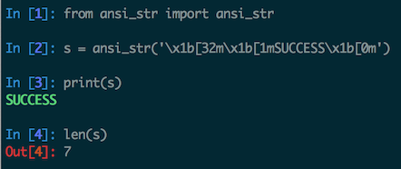

ansi_str
========

An experimental Python ``str`` subclass, whose ``__len__`` method excludes ANSI
color escape codes

When you call the ``__len__`` method, it discounts ANSI color escape codes.
This is beneficial, because ANSI color escape codes won't mess up code that
tries to do alignment, padding, printing in columns/tables, etc.

.. code-block:: python

    In [1]: from ansi_str import ansi_str

    In [2]: s = ansi_str(u'\x1b[32m\x1b[1mSUCCESS\x1b[0m')

    In [3]: len(s)
    Out[3]: 7
